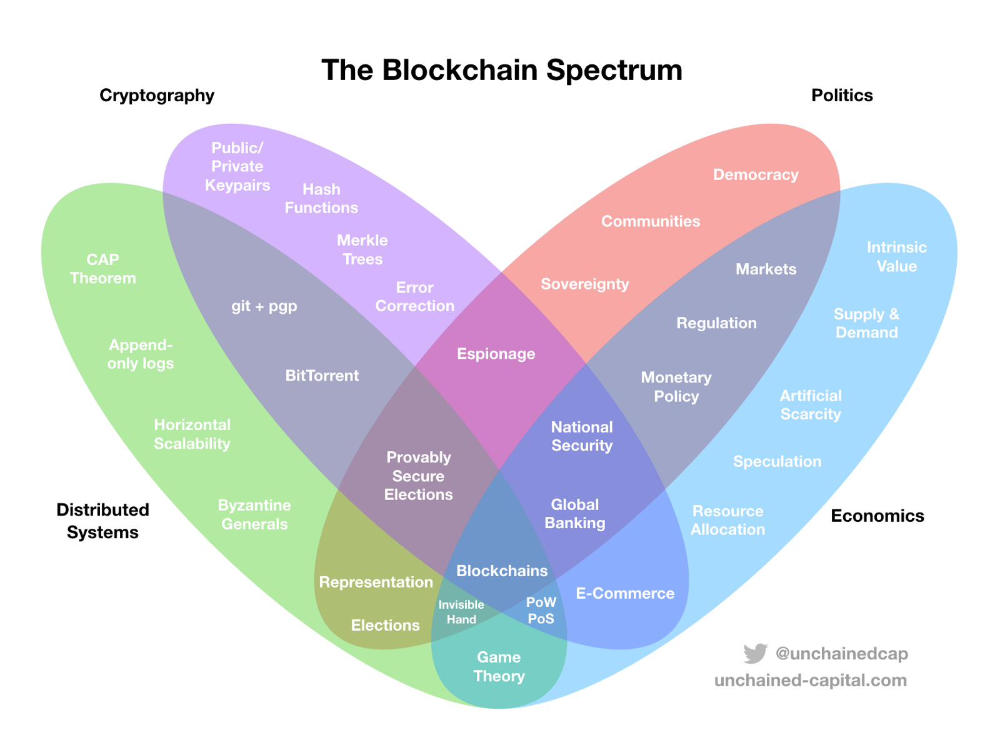
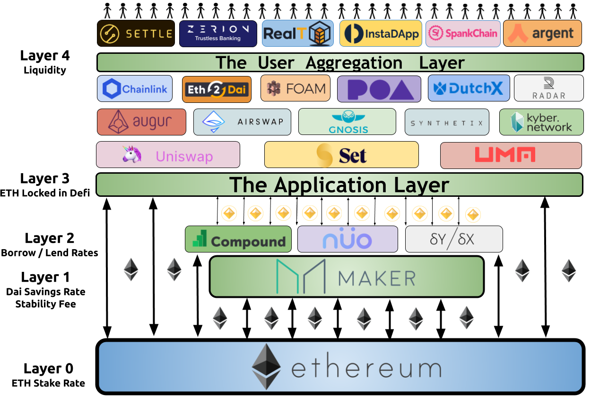

# React Europe Web3 Workshop

This workshop will cover how to use React with Web3 using MetaMask.

Along the way, we will get an overview of blockchains, Ethereum, smart contracts, MetaMask, and why web3 is so cool!

## Set up Commands

```shell
# Installs Truffle globally.
yarn add truffle -g

# Initializes a new, empty Ethereum project.
truffle init
```

---

## Code Deep Dive

### Front End

### Back End

---

## Crash Course into Web3

### What are [blockchains](https://www.youtube.com/watch?v=SSo_EIwHSd4)?

Simply, a single blockchain is like a linked list that is connected by the hash of the previous block of information. By hashing blocks and linking them together, they increase the difficulty of manipulation.

A blockchain network is when this blockchain is spread across various nodes for redundancy. The more decentralized the network, the more tamper-resistant the network. This increases trust in the system, which reduces the need for trust between entities. Through a consensus mechanism, the network's state is constantly updated.

In a sense, a blockchain is a database AND a network rolled up into one.

The blockchain's key innovation is to commoditize trust and allow for coordination between peers in open adversarial environments.

Get a general sense of blockchain and its primitives by playing with a simple one created by [Anders Brownsworth](https://andersbrownworth.com/blockchain/hash).

[This article](https://unchained.com/blog/blockchain-spectrum/) explains why for many, it's [hard to get bitcoin and blockchains in general](https://twitter.com/TaylorPearsonMe/status/923998769045127168). It's an exciting and eye-opening read.



### What is [Ethereum](https://ethereum.org/en/what-is-ethereum/)?

Ethereum is the leading programmbale blockchain, allowing for developers to leverage the security of

To get an understanding of how Ethereum fits into the evolution of the internet, read [Programmable Blockchains in context by Vinay Gupta](https://media.consensys.net/programmable-blockchains-in-context-ethereum-s-future-cd8451eb421e). Its a mind bending but amazing read. His talk on the [history of computing and how it fits with blockchains](https://vimeo.com/161183966) also is worth a look.

### What is [Web3](https://ethereum.org/en/developers/docs/web2-vs-web3/)?

Web2 refers to the version of the internet most of us know today. An internet dominated by companies that provide services in exchange for your personal data.

Web3, in the context of Ethereum, refers to decentralized apps that run on the blockchain. These are apps that allow anyone to participate without monetising their personal data.

### Why Ethereum and Web3?

JavaScript allows you to add interactivity. Ethereum and Solidity enable you to add collaboration and ownership, enabling real decentralization and helping fulfil the internet's promise.

Furthermore, web3 apps on the same blockchain are composable and interoperable. Because the network is the database, web3 apps can build upon each other in a permissionless manner. These qualities led to a Cambrian Explosion of innovation in web3!

A great podcast that puts everything into perspective is [Moon Math - The Bull Case for Cryptography](https://www.youtube.com/watch?v=ycK3AUTdl1w) by Bankless featuring Ethereum Researcher Justin Drake.

### Why is Ethereum so special?

From another perspective, Ethereum and smart contract platforms commoditize networks. Commoditization is important because it helps drive standardization and innovation.

Ethereum commoditizes:

- the network which runs the ecosystem
- the shared database between siloed business logic in the form of smart contracts
- the data generated by these contracts
  security which data and computers depend on to ensure its trustworthiness and immutability of value transfer.
  <br>
  <br>

  

ON a deeper level, through its security guarantees, [Ethereum commoditizes “trust” between people](https://www.youtube.com/watch?v=UIBR99gOLOQ). Ethereum’s brilliance is extending those commodities to any programmable logic made by anyone. This allows for creating any protocol to transmit value in an open fashion with low switching costs between providers.

It also means that you can leverage the security and database of a pre-existing network! If users already have an Ethereum wallet, they can bring their data and credentials to your application. You can remix and leverage their existing data to create new Apps without permission from any third party.

There is no data lock-in!



Etheruem can [transform private goods into public goods and scale it globally at a low cost](https://newsletter.banklesshq.com/p/global-public-goods-and-the-protocol). An example of this is NASDAQ vs the UniSwap Protocol. Or Compound.Finance and Aave vs traditional money markets and setting global interest rates.

Ethereum can also bootstrap communities to run these networks, allowing for shared ownership of public commons.
<br>

### What's a [Smart Contract](https://ethereum.org/en/developers/docs/smart-contracts/#top)?

Smart contracts are programs that run on programmable blockchains like Ethereum.

They have many uses and are limited to your imagination. For example, smart contracts can create decentralized real-time money markets, issue royalties and ownership for art, are parts of video games, and more!

Smart contracts allow you to connect to internet-native value infrastructure and incentivize collaboration to any application.

### What is [MetaMask](https://metamask.io/)?

MetaMask is the leading crypto-wallet and the portal to the internet of value. Trusted by over 21 million users worldwide, start exploring blockchain applications in seconds.

MetaMask is the most permissionless and extensible wallet in the ecosystem. Furthermore, it aims to be the most decentralized and community focused wallet.

Soon, developers will be able to extend Metamask through Metamask Snaps permissionlessly.

Currently, has APIs which allow you to [sign requests](https://docs.metamask.io/guide/signing-data.html#signing-data-with-metamask), act as a [single sign on](https://eliteionic.com/tutorials/creating-web3-login-with-ethereum-metamask-firebase-auth/), sign legal documents like [ETHSign](https://ethsign.xyz/), [encrypt and decrypt messages](https://docs.metamask.io/guide/rpc-api.html#eth-getencryptionpublickey) with your keys, [easily add custom networks and tokens](https://docs.metamask.io/guide/rpc-api.html#wallet-addethereumchain) like [Chainlist.org](https://chainlist.org/).

### What do we use MetaMask for as end user and developer?

For end users, MetaMask is portal to the internet of value. It allows users to interact wtih decentralized applications without having to run their own Ethereum nodes.

Currently, users can interact with over 50,000 DApps and growing!

MetaMask also serves as a secure decentralized key management system, helping users own and control their keys. MetaMask equips you with a key vault, secure login, token wallet, and token exchange—everything you need to manage your digital assets.

### How do we access [Ethereum Network via Metamask](https://docs.metamask.io/guide/ethereum-provider.html)?

See the `/src/index.js`

Checkout [@metamask/detect-provider](https://www.npmjs.com/package/@metamask/detect-provider). You can also use [web3-react](https://github.com/NoahZinsmeister/web3-react) and [web3-react-injector](https://www.npmjs.com/package/@web3-react/injected-connector).

### How do we use [MetaMask APIs](https://docs.metamask.io/guide/ethereum-provider.html#table-of-contents) to interact with Web3?

You can consult our [docs at MetaMask.io](https://docs.metamask.io/guide/).

### Where and how do we hold state with Web3?

    See the /src directory

### How do we interact with Smart Contracts?

    Check out the cryptozombies course referenced below.

### How do we read Smart Contracts?

See our curated list below to learn more! [Solidity by Example](https://solidity-by-example.org/) provides and easy way to learn Solidity.

### What is Truffle?

Truffle is a world class smart contract development environment Ethereum Virtual Machine (EVM) based blockchains.

### What is EthersJS?

The ethers.js library aims to be a complete and compact library for interacting with the Ethereum Blockchain and its ecosystem.

### Want to learn more about DApp development?

See our curated list below!

---

## 🐇 Curated list of resources to go down the rabbit hole:

### General Information and News

- [ConsenSys](https://consensys.net/blog/blockchain-explained/) - Stay up to date with articles from one of the leaders in the Web3.
- [Finematics](https://finematics.com/) Learn about DeFi, NFTs and more from a high level
- [The Defiant](https://thedefiant.io/) - Leading publication for daily Crypto News
- [Bankless](https://newsletter.banklesshq.com/) - Another leading publication to stay up to date and learn hands on strategies for maximum crypto participation.

### Intro

- [Truffle'e Pet Shop tutorial](https://trufflesuite.com/tutorial/index.html) - The best way to quickly get started to learn Ethereum DApp (decentralized application) development.
- [Cryptozombies](https://cryptozombies.io/) - Get an overview of developing a DApp with this freeCodeCamp style website.
- [Solidity by Example](https://solidity-by-example.org/) - Learn Solidity the easy way.

### Intermediate

- [FreeCodeCamp 16 hour Ethereum Development Course](https://www.youtube.com/watch?v=M576WGiDBdQ)
- [OpenZeppelin Getting Started](https://docs.openzeppelin.com/cli/2.6/) - Industry standard libraries for creating secure blockchain applications.
- [Speed Run Ethereum](https://speedrunethereum.com/) - Structured learning path for onboarding developers to Ethereum with 🏗scaffold-eth
- [Scaffold.eth](https://docs.scaffoldeth.io/scaffold-eth/) by [Austin Griffith](https://austingriffith.com/) - Everything you need to build on Ethereum! Quickly experiment with Solidity using a frontend that adapts to your smart contract.

### Advanced

- [Capture the Ether](https://capturetheether.com/) - Capture the Ether is a game in which you hack Ethereum smart contracts to learn about security.
- [Ethernauts](https://ethernaut.openzeppelin.com/) - Learn smart contract security by 'hacking' different contracts due to common vulnerabilities.

### Reference Docs

- [Solidity Docs](https://docs.soliditylang.org/en/v0.8.10/)

### Understand how Ethereum works

- [Eth.build](https://eth.build/) by [Austin Griffith](https://austingriffith.com/) Drag-and-Drop Programming to visually visually understand how Ethereum works
- [Ethereum.org](https://ethereum.org/en/developers/docs/intro-to-ethereum/) - A great place to learn about Ethereum works
- [Mastering Ethereum, by Andreas M. Antonopoulos, Gavin Wood](https://github.com/ethereumbook/ethereumbook) - One of the best books to understand Ethereum from the ground up. Free and open source.

### 🧠 Want to go big brain mode?

- [Vitalik Buterin's website Blog](https://vitalik.ca/) - From Megabrain Vitalik
- [Ethereum Research](https://ethresear.ch/)
- [Cryptoeconomics](https://theblockchainevangelist.com/) - The art and science of creating decentralized networks.
- [Economics Design](https://www.youtube.com/channel/UC-o87lCF9HaEuj0R-3VT1yg) - A great resource to keep up with token design.
- [Token Engineering Community](https://tokenengineeringcommunity.github.io/website/) - A community dedicated to token engineering.

## More Rabbit Holes

- [Truffle Documentation](https://trufflesuite.com/docs/)
- [Ganache Documentation](https://trufflesuite.com/docs/ganache/)
- [MetaMask Documentation](https://docs.metamask.io/guide/)
- [Consensys Webinar: UX For Blockchain](https://learn.consensys.net/catalog/info/id:184)
